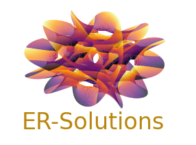

<!--
- 🔭 currently working on ...
- 🌱 currently learning ...
- 💬 Ask me about ...
- 📫 How to reach me: ...
- ⚡ Fun fact: ...
-->

  

# ER-Solutions

The goal is to develop and use existing open-source numerical tools to solve industrial and academic works alike.

We have been using different open-source and free software to address electromagnetic, thermal, CFD and mechanical problems. Amongst these software listed below, [Elmerfem](http://www.elmerfem.org/blog/), has been and remains our main tool to tackle large multiphysics problems. The solver is developed and maintained by [CSC – IT Center for Science](https://www.csc.fi/en/home) in Finland under [Elmer-CSC](https://www.csc.fi/web/elmer).

Hence, in addition to Elmerfem, our experience covers the following software:

- Geometry/mesh builders:

 
 &nbsp;
 

[Onelab](https://onelab.info/)
&nbsp;
[Salome](https://www.salome-platform.org/)

- FE solvers:

 
 &nbsp;
 
 &nbsp; &nbsp; &nbsp;
 
 &nbsp; &nbsp;
 

[Elmer](http://www.elmerfem.org/blog/)
&nbsp;
[Code_Aster](https://www.code-aster.org/spip.php?rubrique2)
&nbsp;
[Code_Saturne](https://www.code-saturne.org/cms/web/)
&nbsp;
[Openfoam](https://openfoam.org/)

#  🎥 Videos

Some videos related to the handling of the software can be found on our Youtube channel.

 

# 🧑‍🔬 Online profiles

For some information on who we are and what we are currently doing, you may look at our online profiles:

Frederic Trillaud :

 

Eelis Takala:

 

# :fire: Statistics:

