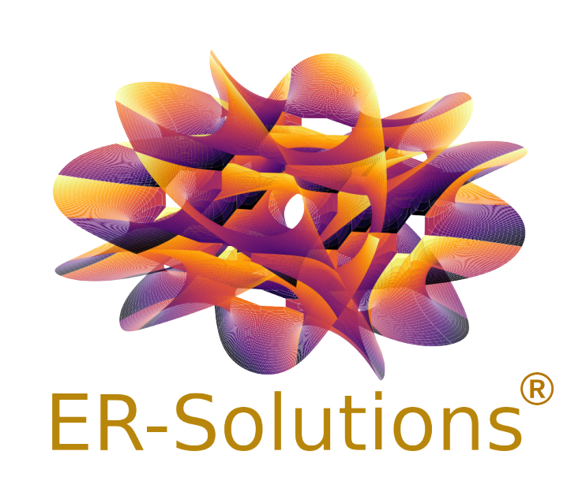
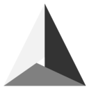

<!--
- 🔭 currently working on ...
- 🌱 currently learning ...
- 💬 Ask me about ...
- 📫 How to reach me: ...
- ⚡ Fun fact: ...
-->

  

# Company information

ER-Solutions is a consulting company registered in Finland. It provides Finite Element solutions to professionals by pulling numerical tools from the open-source world and customized them to the need at hand.

# The free world at your hand

The goal is to develop and use existing open-source numerical tools to bring turnkey solutions to industrial and academic clients and partners alike.

We have been using different open-source and free software to address electromagnetic, thermal, CFD and mechanical problems. Amongst these software listed below, [Elmerfem](http://www.elmerfem.org/blog/), has been and remains our main tool to tackle large multiphysics problems. The solver is developed and maintained by [CSC – IT Center for Science](https://www.csc.fi/en/home) in Finland under [Elmer-CSC](https://www.csc.fi/web/elmer).

Hence, in addition to Elmerfem, our experience covers the following software:

- Geometry/mesh builders:

 
 &nbsp;
 

[Onelab](https://onelab.info/)
&nbsp;
[Salome](https://www.salome-platform.org/)

- FE solvers:

 
 &nbsp; &nbsp; &nbsp;
 
 &nbsp; &nbsp; &nbsp;
 
 &nbsp; &nbsp; &nbsp;
 

[Elmer](http://www.elmerfem.org/blog/)
&nbsp;
[Code_Aster](https://www.code-aster.org/spip.php?rubrique2)
&nbsp;
[Code_Saturne](https://www.code-saturne.org/cms/web/)
&nbsp;
[Openfoam](https://openfoam.org/)

Main programming languages:
- [Python](https://www.python.org/)
- [Fortran](https://fortran-lang.org/)

#  🎥 Videos

Some videos related to the handling of the software can be found on our Youtube channel.

 

# 🧑‍🔬 Profiles

For some information on who we are and what we are currently doing, you may look at our online profiles (click name or photos to get redirected):

<table>
 <tr>
  <td>
   

    
   

  </td>

  <td>
  

   
   

  </td>
 </tr>

 <tr>
  <td>
   

    <a href="https://github.com/ftrillaudp">Frederic Trillaud</a>
    
   

  </td>

  <td>
   

    <a href="https://github.com/ettaka/">Eelis Takala</a>
   

  </td>
 </tr>

 <tr>
  <td>
    

     Associate professor at the <a href="https://www.unam.mx/">National Autonomous University of Mexico</a>. Focus on multiphysics modeling development with experience in electromagnetic, thermal, CFD (thermofluid, CFD-structure interaction and electrohydrodynamic simulations) and structural mechanics (elastic and elastoplastic models).
    

   </td>

   <td>
    

     Development Engineer and lead research specialist at <a href="https://trafotek.fi/">AK Trafotek Oy</a>. Focus on multiphysics modeling development with experience in electromagnetic with circuit coupling, thermal and mechanical (elastic and elastoplastic models).
    

   </td>
 </tr>
</table>

# :bell: Contacts

Contact available in English, French, Spanish and Finnish:
<a href="mailto:elemental.reality.solutions@gmail.com">📩 ER-Solutions</a>

# :fire: Statistics:

